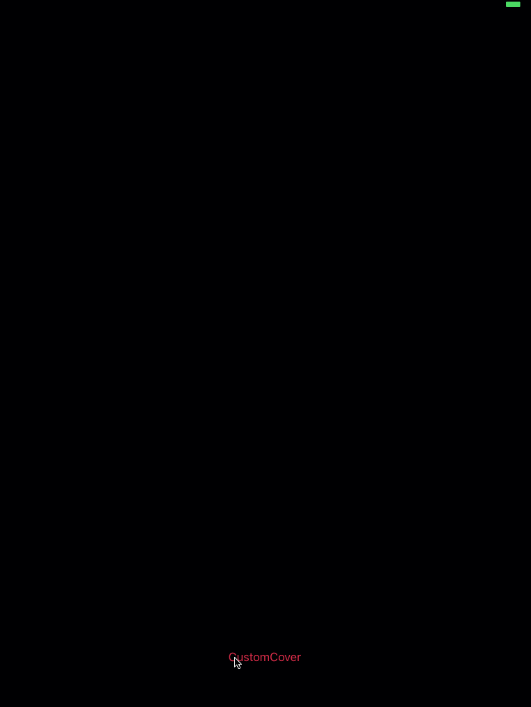

# FluctuateViewController

[](https://developer.apple.com/iphone/index.action)

[](https://img.shields.io/badge/Cocoapods-compatible-brightgreen.svg)
[](https://github.com/Carthage/Carthage)
[](http://mit-license.org)


  

<br>

## Features
Assumed mainly used on iPad.
(Ex. acceptance application.)  
Home view is covered by 'CoverView' to show the title or some purpose of the application.  
To use effectively iPad's high screen, the manipulation is done mainly by swipe up and down.
## Installation and Setup
### CocoaPods
Add your Podfile
```
pod install FluctuateViewController
```

### Carthage
Add your Cartfile
```
github "SakuragiYoshimasa/FluctuateViewController"
```

## How to use

Make subclass of FluctuateViewController.  
To use your custom menu view or cover view, inherit "MenuView" and "CoverView". If you want more detail, please see "CustomMenuView" and "CustomCoverView" in a Demo.

### Basic setting

```
override func viewDidLoad() {
    super.viewDidLoad()
    //Setting propaties
    fluctuateView.setPropaties(propaties: FluctuateViewPropaties(animationDuration: 0.4, menuHeight: 300, offsetOnNocontent: 300, offsetOnFixedContent: 200, fullCoveredOffset: 60))
}

```

### DataSource

```
// FluctuateViewDataSource
    override func contentsCount() -> Int { return 3 }

    override func fluctuateView(_ fluctuateView: FluctuateView, contentTitle index: Int) -> String {
        return "\(index)"
    }

    override func fluctuateView(_ fluctuateView: FluctuateView, contentByIndex index: Int) -> UIViewController {

        switch index {
        case 0:
            return UIStoryboard(name: "FixedVCDemoVC", bundle: nil).instantiateInitialViewController()!
        case 1:
            return UIStoryboard(name: "FixedScrollDemoVC", bundle: nil).instantiateInitialViewController()!
        case 2:
            return UIStoryboard(name: "FullScrollDemoVC", bundle: nil).instantiateInitialViewController()!
        default:
            return UIViewController()
        }
    }

    override func fluctuateView(_ fluctuateView: FluctuateView, contentTypeByIndex index: Int) -> ContentViewType {
        return index < 2 ? .fixed : .full
    }

    override func coverView() -> CoverView {
        return CustomCoverView(frame: self.view.frame)
    }

    override func menuView() -> MenuView {
        return CustomMenuView(frame: self.view.frame)
    }

    override func noContentView() -> UIViewController {
        let vc = UIViewController()
        vc.view.backgroundColor = UIColor.darkGray
        return vc
    }
```

### Delegate

```
// FluctuateViewDelegate
    override func onStateChage(_ state: FluctuateViewState){
        print("\(state)")
    }

```

### MenuView

Like this, your custom menu view need to inherit "MenuView" and override recreateMenuViewByContents and call select(contentIndex: Int) according to your situations.

```
  class CustomMenuView : MenuView {

    var buttons: [UIButton] = []

    override func recreateMenuViewByContents(dataSource: FluctuateViewDataSource){
        buttons.forEach({ $0.removeFromSuperview() })
        buttons = []

        for i in 1...dataSource.contentsCount() {
            let button = UIButton(frame: CGRect(x: i * 120 + 100,y: 100, width: 100, height: 60))
            button.backgroundColor = UIColor.black
            button.setTitleColor(UIColor.white, for: .normal)
            button.setTitle("\(i)", for: .normal)
            button.tag = i
            button.addTarget(self, action: #selector(self.selectContent(_:)), for: .touchUpInside)
            buttons.append(button)
            addSubview(button)
        }
    }

    func selectContent(_ sender: UIButton) {
        select(contentIndex: sender.tag)
    }
}

```

### CoverView

Only you need is inherit "CoverView".

## License
MIT license.  [LICENSE](./LICENSE)
